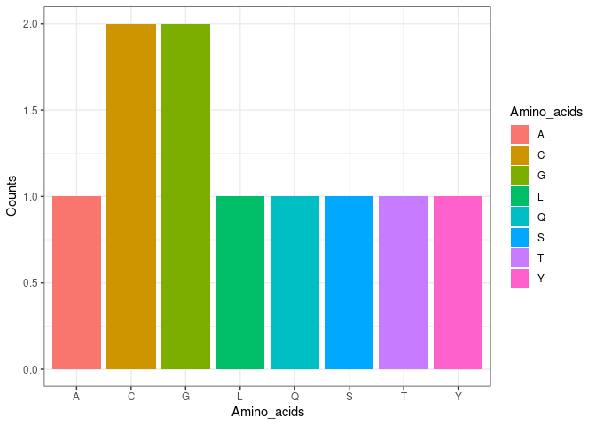

The biocentral package for all your central dogma needs
================

## Group 1

-   Danli Shen (s185387)

-   Dave Rojas (s212767)

-   Mathias N. Stokholm (s184257)

-   Ziyu Zhang (s212657)

-   Karolina Krzesińska (s212842)


The biocentral R package contains functions pertaining to the central
dogma including transcription and translation. The package also contains
functions to synthesise DNA and measure amino acid frequency in a
peptide.

First the package is installed and loaded.

``` r
if (!require("biocentral", quietly = TRUE))
    devtools::install_github("rforbiodatascience22/group_1_package")
library(biocentral)
```

# Transcription

To transcribe a DNA sequence we first need to synthesise our DNA with
the createdna function.

``` r
set.seed(123)
DNAseq <- createdna(30)
DNAseq
#> [1] "GGGTGTTTGACTTATGCAGGACAAAGCTGT"
```

Next, the DNA sequence is transcribed using the dna_to_rna function.

``` r
RNAseq <- dna_to_rna(DNAseq)
RNAseq
#> [1] "GGGUGUUUGACUUAUGCAGGACAAAGCUGU"
```

# Translation

Next, insert the RNA sequence in the codon_start function to split the
sequence to codons. Here we start at position 1, but other reading
frames can be used by changing the start position.

``` r
codons <- codon_start(RNAseq, start = 1)
codons
#>  [1] "GGG" "UGU" "UUG" "ACU" "UAU" "GCA" "GGA" "CAA" "AGC" "UGU"
```

Translation is done with the codon2amino function.

``` r
aa <- codon2amino(codons)
aa
#> [1] "GCLTYAGQSC"
```

# Amino Acid Frequency

To determine the amino acid frequency, the seq_count function is used.
This function will create a bar plot showing the amino acid frequency.
It will only show the amino acids that appear at least once in the
sequence.

``` r
seq_count(seq = aa)
```

<!-- -->
